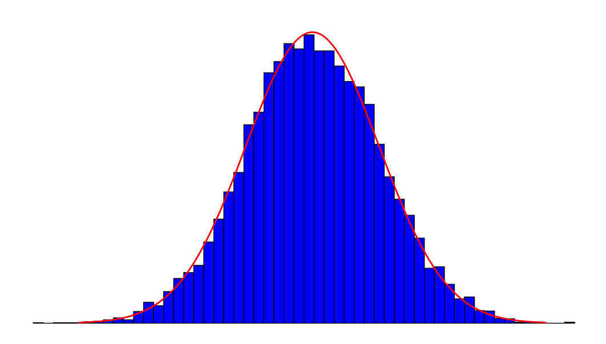

<style>
body {
text-align: justify}
</style>

```{r setup, include=FALSE}
knitr::opts_chunk$set(echo = TRUE)
```

# M358K: Applied Statistics - Fall 2020  - Syllabus

### COURSE-SPECIFIC INFORMATION

``` {r echo=FALSE, out.width= "53%", out.extra='style="float: right; padding-right: 00px"'}

```


Welcome to M358K! Here is some information and some ground rules. Read carefully and let me know if there is anything unclear **by the twelfth day of classes, i.e., September 11th**.  <span style="color: blue;">This syllabus is subject to change; students who miss class are responsible for learning about any changes to the syllabus.</span> 

------------------------------------------------------------------------

### Basic info

**Course number.** M358K (unique: 53815)

**Course meets.** By **Zoom**, MWF 12:00noon-1:00pm

**Flags.** <span style="color: blue;">QR (Quantitative Reasoning)</span>: This course carries the Quantitative Reasoning flag. Quantitative
  Reasoning courses are designed to equip you with skills that are
  necessary for understanding the types of quantitative arguments you
  will regularly encounter in your adult and professional life. You
  should therefore expect a substantial portion of your grade to come
  from your use of quantitative skills to analyze real-world
  problems.

**Instructor.** <span style="color: blue;">Milica Čudina</span> (she/her/hers); my usual office is PMA 13.142 (2515 Speedway, Austin, TX 78712), but I will **not** be spending any time there due to the pandemic. 

**Email.** It's best to use Canvas to email the instructor. The instructor's email address is mcudina@math.utexas.edu. The teaching assistant's contact information will be shared at a later date. 

**Office Hours.** By **Zoom**, TTh 11:00am-12:00noon

------------------------------------------------------------------------

### Course info

**Course Description.** This course covers introductory topics in applied statistics. The material includes: data visualization techniques, foundations of statistical inference, inference for numerical and categorical data, and simple linear regression. 

**Learning Objectives.**

- Students will become versed in techniques for data visualization and interpretation of graphical representations of information and data.

- Students will become familiar with the basics of the programming language R and the RStudio IDE. They will 
learn how to use R to simulate random variables.

- Students will build up the basic vocabulary indispensable in the data-driven workplace.

- Students will acquire the principles of statistical inference both in terms of skills necessary to perform a simple statistical analysis and in terms of critical thinking when faced with others' conclusions (say, in the press). 


**Prerequisites.** The formal prerequisite is the grade C- or better in
M362K. Students are
assumed to be at home with the basics of probability as presented in,
e.g., Ross's [First Course in Probability](https://www.pearson.com/us/higher-education/program/Ross-First-Course-in-Probability-A-9th-Edition/PGM110742.html), Pitman's [Probability](https://www.springer.com/us/book/9780387979748) or Asimow and Maxwell's [Probability and Statistics with Applications](https://books.google.com/books/about/Probability_and_Statistics_with_Applicat.html?id=ZL3QQZsp6DAC). 

Students are **not** assumed to have any prior programming experience and 
the basics of R will be covered from scratch. 

**Class format and online attendance.** The class will be conducted completely online. Attendance for the purposes of grading will not be taken. However, regular attendance (synchronously or asynchronously) is strongly recommended. In case you need to be absent, you are responsible for covering the
  missed material independently.

**Textbook.**
The required textbook is:

[OpenIntro Statistics](https://www.openintro.org/book/os/) by David Diez, Mine Çetinkaya-Rundel, and Christopher D Barr. 

**Required devices.** You will need a calculator
(any type which can do arithmetic operations). You will also need access to a computer to be able to work on projects and attend class via Zoom. 

**Online resources.** 

1. **Course website**: <https://gordanz.github.io/cudina/M358K.html> I recommend bookmarking this course site in your default browser for easy access.

2. **Zoom** will be used for all classes and for office hours. Videos of all zoom sessions (except for private meetings) will be accessible to all students via Canvas. They will include transcripts of the lectures and chat logs (with possible day due to processing).

3. **Canvas** will be used in this course to keep track of grades and for communication purposes. The students are responsible for the content of these announcements. The easiest way not to miss any is to turn on (i.e., not turn off) *Announcements* in their account’s *Notification* menu.

4. **Piazza** will be used for informal class discussion. The system is highly catered to getting you help fast and efficiently from classmates and myself. Rather than emailing questions to the instructor, I encourage you to post your questions on Piazza. Our class signup link is  <https://piazza.com/utexas/fall2020/m358k>


**Sharing of Course Materials is Prohibited.** No materials used in this class, including, but not limited to, lecture hand-outs, videos, assessments (quizzes, exams, papers, projects, homework assignments), in-class materials, review sheets, and additional problem sets, may be shared online or with anyone outside of the class unless you have my explicit, written permission. Unauthorized sharing of materials promotes cheating. It is a violation of the University’s Student Honor Code and an act of academic dishonesty. I am well aware of the sites used for sharing materials, and any materials found online that are associated with you, or any suspected unauthorized sharing of materials, will be reported to Student Conduct and Academic Integrity in the Office of the Dean of Students. These reports can result in sanctions, including failure in the course. 

**Class Recordings.**  Class recordings are reserved only for students in this class for educational purposes and are protected under FERPA. The recordings should not be shared outside the class in any form. Violation of this restriction by a student could lead to Student Misconduct proceedings.

------------------------------------------------------------------------

### Assessment and grading

**Short quizzes.**  You will have various short warm-up and review worksheets to complete at home and upload to Canvas. The quizzes will be posted on the course website. **The lowest two quiz scores will be
    dropped. The quizzes and their due dates will be
    announced as the term progresses.**


**Homework assignments.** Homework assignments will be available on the course website. You will be uploading your solutions using Canvas. Your solutions need to be in order and you should number the pages. <span style="color: blue;">Having read and understood this First-Day Handout in
  its entirety will count as a homework assignment. To get the credit, read this entire document with understanding by September 11th. Not handing in this assignment does not exempt you from abiding by this
  First-Day Handout.</span> **The lowest two homework scores will be dropped. The homework assignments and their due dates will be announced as the term progresses.**

**Projects.** There will be three in-term group projects and an individual final project. The nature and content of the projects will be described in
    more detail as new techniques are introduced. However, every group-project will: 
 
 1. be done as part of a group of students (as assigned by the instructor);
 
 2. include data gathering (in our current circumstances this will probably be using already available data from external sources or simulating data in R);
 
 3. involve statistical analysis and data presentation;
 
 4. require critical thinking and drawing logical
    conclusions.

<span style="color: red;">No late projects are accepted. All assigned projects must be completed in order to earn a passing grade in this course!</span>

**In-term Exams.** There will be a total of **three** in-term exams. Their dates are:

 1. September $28^{th}$

 2. October $30^{th}$

 3. December $4^{th}$

You will receive specific instructions for each exam. The exams themselves will be Canvas quizzes proctored by Proctorio. You will receive a 24-hour window during which you will be able to complete the 50-minute exam (at the time of your choosing) and submit your solutions in Canvas. We will practice this feature through mock-exam homework assignments before the actual exam(s). 

**The Final Exam.** Due to extenuating circumstances, there will be **no** comprehensive final exam. Instead, every student will have to complete an individual project and upload it to Canvas by the end of day (11:59pm) on the date of the university-scheduled final exam. For this course and section, this date is **Saturday, December $12^{th}$.**

**Final grade.** The final grade is composed as follows:

|      Assignment      | Percentage of final grade |
|--------------------- |---------------------------|
| Quizzes              |           8%             |
| Homework             |           8%             |
| Projects             |      48% (12% each)       |
| Exams                |      36% (12% each)       |

There is *no curve* in this class and the letter grades are assigned
according to the following table:

A | A-|  B+  | B | B- |  C+ | C | C- | D+ | D |  D- | F
---|---|---|---|---|---|---|---|---|---|---|
94 - 100| 90-94 |  86 - 90 |  83 - 86 | 80 - 83 | 75 - 80 | 70 - 75 | 65 - 70 | 60 - 65 | 55 - 60 | 50 - 55 | 0 - 50

------------------------------------------------------------------------

### GENERAL, UNIVERSITY- or STATE-MANDATED INFORMATION


**Drop dates.** The procedure/consequences are different, depending on whether you drop
before or after the 12th day of classes (09/11), and then, before or
after the *main drop (Q-drop) date* (10/29). (See
<https://ugs.utexas.edu/vick/academic/adddrop> for details)


**Academic (dis)Honesty.** Students who violate University rules on academic dishonesty are subject
to disciplinary penalties, including the possibility of failure in the
course and/or dismissal from the University. Since such dishonesty harms
the individual, all students, and the integrity of the University,
policies on academic dishonesty will be strictly enforced. For further
information, please visit the Student Conduct and Academic Integrity
website at: <http://deanofstudents.utexas.edu/conduct>


**Students with Disabilities.** The University of Texas at Austin provides upon request appropriate
academic accommodations for qualified students with disabilities. If you
have a documented disability and you need special treatment as a result
of your disability, please let me know as soon as possible, but
definitely within the first 3 weeks of class. For more information,
contact the Office of the Dean of Students at 471-6259, 471-4641 (TTY),
1-866-329- 3986 (video phone) or go to
<http://ddce.utexas.edu/disability/>


**Religious holy days.** Religious holy days sometimes conflict with class and examination
schedules. Sections 51.911 and 51.925 of the Texas Education Code relate
to absences by students and instructors for observance of religious holy
days.

Section 51.911 states that a student who misses an examination, work
assignment, or other project due to the observance of a religious holy
day must be given an opportunity to complete the work missed within a
reasonable time after the absence, provided that he or she has properly
notified each instructor.

It is the policy of The University of Texas at Austin that the student
must notify each instructor at least fourteen days prior to the classes
scheduled on dates he or she will be absent to observe a religious holy
day. For religious holidays that fall within the first two weeks of the
semester, the notice should be given on the first day of the semester.
The student may not be penalized for these excused absences but the
instructor may appropriately respond if the student fails to complete
satisfactorily the missed assignment or examination within a reasonable
time after the excused absence.


**Counseling and mental health.** Counseling and other mental-health services are available from
**Counseling and Mental Health Center**, Student Services Bldg (SSB),
5th Floor. (hours: M--F 8am--5pm. phone: 512 471 3515, web:
<http://www.cmhc.utexas.edu>)


**Sanger Learning Center.** All students are welcome to take advantage of Sanger Center's classes
and workshops, private learning specialist appointments, peer academic
coaching, and tutoring for more than 70 courses in 15 different subject
areas. For more information, please visit
 <http://www.utexas.edu/ugs/slc> or call 512-471-3614 (JES A332).


**Important Safety Information.** If you have concerns about the safety or behavior of fellow students,
TAs or Professors, call BCAL (the Behavior Concerns Advice Line):
512-232-5050. Your call can be anonymous.

Further information about (campus) safety and security can be obtained
from the Office of Campus Safety and Security, 512-471-5767,
<http://www.utexas.edu/safety/>

<!-- Occupants of buildings on The University of Texas at Austin campus are -->
<!-- required to evacuate buildings when a fire alarm is activated. Alarm -->
<!-- activation or announcement requires exiting and assembling outside. -->

<!-- -   Familiarize yourself with all exit doors of each classroom and -->
<!--     building you may occupy. Remember that the nearest exit door may not -->
<!--     be the one you used when entering the building. -->

<!-- -   Students requiring assistance in evacuation shall inform their -->
<!--     instructor in writing during the first week of class. -->

<!-- -   In the event of an evacuation, follow the instruction of faculty or -->
<!--     class instructors. Do not re-enter a building unless given -->
<!--     instructions by the following: Austin Fire Department, The -->
<!--     University of Texas at Austin Police Department, or Fire Prevention -->
<!--     Services office. -->

<!-- -   Link to information regarding emergency evacuation routes and -->
<!--     emergency procedures can be found at: -->
<!--     <http://www.utexas.edu/emergency> -->

------------------------------------------------------------------------


### The SCHEDULE of CLASSES 

Number|Date|Weekday|Topic
---|---|---|---
1|Aug 26|Wed|  Introduction. Getting used to Zoom.
2|Aug 28|Fri|  RStudio and R - setup.
3|Aug 31|Mon|  Basic R, R notebooks.
4|Sept 2|Wed|  Simulation of random variables.
5|Sept 4|Fri|  What is statistics? Types of random variables.
6|Sept 9|Wed|  Data visualization. 
7|Sept 11|Fri| Explanatory and response variables. Scatterplots. 
8|Sept 14|Mon| Sampling principles and strategies. Randomized response.  
9|Sept 16|Wed| Examining numerical data. 
10|Sept 18|Fri|Considering categorical data. 
11|Sept 21|Mon| Statistical inference. 
12|Sept 23|Wed| Statistics and the sampling distribution. 
13|Sept 25|Fri| The sampling distribution of a sample mean. 
14|Sept 28|Mon| **In-term 1**
15|Sept 30|Wed| The sampling distribution [counts and proportions]. 
16|Oct 2|Fri| The normal distribution (review).
17|Oct 5|Mon| Sample mean (the normal sample).
18|Oct 7|Wed| The Central Limit Theorem (review).
19|Oct 9|Fri| More on the binomial distribution.  
20|Oct 12|Mon| The normal approximation to the binomial distribution.  
21|Oct 14|Wed| Parameter estimation: point estimates. 
22|Oct 16|Fri| Confidence intervals for a proportion.
23|Oct 19|Mon| Principles of hypothesis testing.
24|Oct 21|Wed| The reasoning of tests of significance. p-values.
25|Oct 23|Fri| Hypothesis testing for a proportion.  
26|Oct 26|Mon| Inference as a decision.
27|Oct 28|Wed| Inference for a single proportion.  
28|Oct 30|Fri| **In-term 2**
29|Nov 2|Mon| Comparing two proportions.
30|Nov 4|Wed| Chi-square distribution. 
31|Nov 6|Fri| Testing for goodness of fit using chi-square.
32|Nov 9|Mon| Analysis of two-way tables. 
33|Nov 11|Wed| Testing for independence in two-way tables.
34|Nov 13|Fri| t-distribution.
35|Nov 16|Mon| One-sample means with the t-distribution. 
36|Nov 18|Wed| Inference for the mean of a normal population.
37|Nov 20|Fri| t-test.
38|Nov 23|Mon| Comparing two means.
39|Nov 30|Mon| Power calculations for a difference of means.
40|Dec 2|Wed|  Fitting a line, residuals, and correlation.
41|Dec 4|Fri| **In-term 3**
42|Dec 7|Mon| Least-squares regression. 

